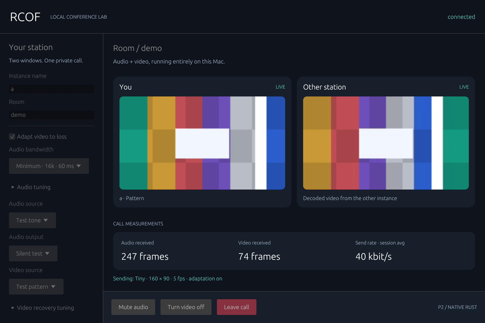

# RCOF 🦀

**A Rust hobby project for learning how a video call actually works.**

Two native windows on one Mac exchange Opus audio and VP8 video. A local network simulator lets you squeeze the bandwidth, delay packets, lose them, and watch the call recover. No cloud account or Internet connection is needed at runtime.

[Start the learning report](reports/019-learning-report.md) · [Architecture](docs/architecture-proposal.md) · [Optimization results](reports/018-bandwidth-optimization.md)



## Run it

Tested on Apple Silicon macOS with Rust 1.91.0. Install Rust and the Xcode command-line tools first, then:

```sh
brew install opus ffmpeg
git clone https://github.com/ytp101/rcof.git
cd rcof
cargo build --release --locked
python3 scripts/demo_p1.py --binary target/release/rcof
```

Both windows start with generated audio/video and **silent playback**. To try real devices:

1. Leave the call in both windows.
2. Choose **Microphone** and **Headphones / speaker**. Use headphones: echo cancellation is not implemented.
3. Choose **Camera** in one window and **Test pattern** in the other.
4. Join both windows again. Allow macOS camera/microphone access when requested.

Close both windows or press Ctrl+C in the terminal to stop. Manual demos do not time out. First-time builds download dependencies; cached builds can use `--offline`. See the [device and troubleshooting guide](docs/running-p1.md).

## What is implemented?

| Step | What it taught us | Result |
| --- | --- | --- |
| P0: audio | Device callbacks, ownership, Opus, signaling, task cleanup | Two-way local audio and CLI controls |
| P1: native video | FFmpeg, RTP fragmentation, UI/media separation | Camera/pattern video, mute, video toggle, leave/rejoin |
| P2: poor networks | Queue limits, loss, priorities, feedback, measurement | UDP link simulator, adaptive video, short-outage recovery |
| Optimization | Packet overhead, codec effort, latency tradeoffs | Optional audio profiles, silence compression, video refresh tuning |

The code is Rust; existing libraries implement WebRTC, device access, codecs, and the GUI. FFmpeg runs as a child process. This project integrates those pieces—it does not invent a new codec.

## How low can the bandwidth go?

Measured local tests, **per direction**, including IPv4/UDP and encrypted media/control:

| Generated-source test | Original | Optional optimized mode |
| --- | ---: | ---: |
| Audio + Tiny video | 76.74 kbit/s | **45.25 kbit/s** |
| Audio only | 54.45 kbit/s | **25.82 kbit/s** |

Tiny is **160×90 at 5 fps**. The optimized audio/video test used 16 kbit/s Opus in 60 ms packets and a two-second video keyframe interval. It worked under a **64 kbit/s cap each way**, delivering 100/90 video frames over 20 seconds without audio sequence gaps. At 48 kbit/s, video was too sparse to recommend.

That is about **41% less measured traffic than this project's original Tiny configuration**, with tradeoffs: longer packetization delay, potentially lower audio fidelity, and slower picture recovery. These are short generated-tone/pattern tests, not guaranteed real-camera requirements or an equal-quality comparison with commercial apps. [Method, evidence, and failed experiments](reports/018-bandwidth-optimization.md).

Try the optional mode:

```sh
python3 scripts/demo_p1.py --binary target/release/rcof \
  --audio-profile minimum --quality tiny --keyframe-seconds 2
```

The original settings remain the default. Compare **Original**, **Efficient**, and **Minimum** in the sidebar. [Optimization guide](docs/optimization.md).

## Make the local network worse

```sh
python3 scripts/check_p2.py --binary target/release/rcof --gui \
  --profile constrained --adaptive --duration 36
```

This limits each direction to 128 kbit/s at second 5 and restores the link at second 30. In interactive mode, `--duration` controls the impairment schedule; the windows stay open. Add `--verify-gui` only for a timed automated check. Other profiles simulate loss, jitter, setup trouble, and a three-second outage. [P2 guide](docs/running-p2.md).

## Learn from the code

Read the [learning report](reports/019-learning-report.md) first: it follows a call from microphone to speaker, connects Rust concepts to actual functions, explains the bugs, and gives small experiments to try.

- [Project overview](docs/overview.md)
- [Architecture and tradeoffs](docs/architecture-proposal.md)
- [Audio code tour](docs/p0-code-tour.md) and [video/UI code tour](docs/p1-code-tour.md)
- [Measurement guide](docs/low-bandwidth-video.md)
- [Development and verification](CONTRIBUTING.md)

## Boundaries

This is a **same-Mac learning lab**, not a production conferencing service. IPv4 loopback is enforced, and the timing extensions assume a shared host clock. It has no accounts, public deployment, cross-device support, group calls, echo cancellation, or automatic reconnection after terminal connection failure. Decode timing is not physical mouth-to-ear latency. Device-clock drift and occasional output-device issues still need investigation.

The sandbox-based checks are macOS-specific. A packaged local `.app` can be built with `sh scripts/package_macos.sh --release`; it still requires the native dependencies and is not a signed, self-contained download.
