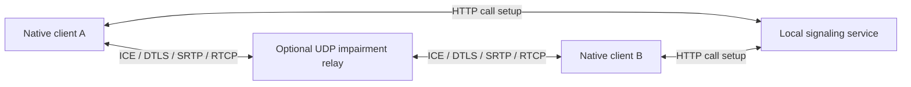

# Architecture and tradeoffs

RCOF runs two native Rust clients on one Mac. The first milestones are implemented; this document describes the current system.

Without the relay, clients exchange media directly over loopback. Signaling remains separate from the simulated media link. The relay carries connection setup traffic as well as encrypted audio/video, so an all-drop profile can actually prevent the call from connecting.

## Inside a client

| Module | Responsibility |
| --- | --- |
| [`main.rs`](../src/main.rs) | CLI entry points and runtime selection |
| [`signaling.rs`](../src/signaling.rs) | Two-person rooms, message exchange, session expiry |
| [`call.rs`](../src/call.rs) | WebRTC negotiation, lifecycle, audio workers, controls, loss handling |
| [`audio.rs`](../src/audio.rs) | CPAL devices, bounded queues, resampling, playback clock, profiles |
| [`video.rs`](../src/video.rs) | FFmpeg capture/codecs, VP8 RTP fragments, decoder recovery, adaptation |
| [`ui.rs`](../src/ui.rs) / [`controls.rs`](../src/controls.rs) | egui rendering, commands, shared state snapshots |
| [`metrics.rs`](../src/metrics.rs) | Counters, fixed-size timing histograms, JSON summaries |
| [`link.rs`](../src/link.rs) | Seeded impairment, bandwidth serialization, bounded priority queues |

Audio device callbacks move samples through bounded queues. Sending and receiving audio each use a dedicated worker thread/runtime. The GUI sends commands and reads snapshots; it does not encode media in its draw callback. Video stages use child processes and bounded/latest-frame channels. Dropping their owners cancels and joins work.

## Why these choices?

| Choice | Benefit | Cost |
| --- | --- | --- |
| Rust orchestration | Explicit ownership and cleanup; efficient native code | Ownership across callbacks/async work takes care |
| CPAL + Opus | Device access plus speech-oriented compression | Native dependency, platform formats, codec tradeoffs |
| WebRTC.rs | Existing ICE/DTLS/SRTP/RTCP implementation | Negotiation and media integration remain substantial |
| FFmpeg + VP8 | Working camera and video codecs without writing one | Child processes, pipe copies, external installation |
| eframe/egui | A native Rust interface | The UI must stay separate from real-time work |
| Bounded queues/latest frame | Bound memory and stale-media delay | Congestion drops data rather than preserving everything |
| Same-host loopback | Repeatable first experiment and shared timing clock | Does not demonstrate cross-device timing or deployment |

## Network and recovery behavior

The relay budgets IPv4/UDP overhead as well as payload bytes. Each direction has independent queues; audio/control can displace queued video, while a packet already transmitting cannot be preempted. Queued data expires instead of accumulating unbounded latency. Loss decisions use seeded random generators, but OS scheduling still changes whole-run results.

Video adaptation reacts to receiver loss reports: sustained loss steps down, several clean reports allow a step up, and the selected quality is the ceiling. This can oscillate; it is not a full bandwidth estimator. Audio waits briefly for reordered packets and conceals at most 60 ms of missing sound. Periodic video keyframes enable picture recovery.

A three-second outage is tested to recover within the existing connection. A terminal connection failure requires both peers to rejoin. Echo cancellation, robust clock-drift correction, production authentication, automatic reconnection, and multi-party media routing remain future work.

See [P2 experiments](running-p2.md), [the optimization report](../reports/018-bandwidth-optimization.md), and [the learning report](../reports/019-learning-report.md).
