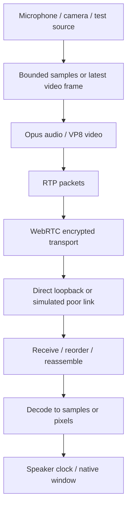

# What I learned building a Rust conferencing lab

RCOF started with a small question: could a native Rust app carry understandable audio and video with very little bandwidth? The result is a hobby lab: two windows, one Mac, and enough control over the simulated network to see why calls fail or recover.

This report is a reading guide to the implementation. It explains the ideas in the code, including the mistakes. It is not a claim that the codecs or WebRTC stack were written from scratch.

## 1. A call is several systems working together

A video call looks like one feature. Internally, it is a pipeline:



Signaling is a separate conversation: who is in the room, which capabilities can each peer receive, and how do they connect? In RCOF, a small HTTP service handles that exchange. The media then travels through WebRTC.

This separation gave us a useful debugging question: **is call setup failing, is media missing, or is playback late?** A connected status alone does not answer all three.

Read [`signaling.rs`](../src/signaling.rs), then `Peer` and `session` in [`call.rs`](../src/call.rs).

## 2. Ownership becomes practical when things must stop

Rust ownership is often introduced with strings and vectors. Here it has a visible consequence: when a call ends, its microphone, worker threads, and FFmpeg processes must stop too.

`Audio` owns the device streams. `AudioWorker` owns a cancellation sender and a thread handle. Its `Drop` implementation signals cancellation and joins the worker. Video has owners for child processes and tasks. The call session coordinates those owners instead of relying on unrelated background work to disappear eventually.

The lesson is to ask two questions for every resource:

1. Who owns it while the call is active?
2. What path releases it on leave, error, timeout, or peer failure?

A happy-path call is not enough. The test scripts deliberately leave rooms, time out, kill a peer, and stop the signaling server. Those are lifecycle tests.

## 3. Sharing data does not mean sharing everything

Several parts of the app need to observe call state. Rust gives us different tools for different jobs:

| Tool in this project | Purpose | What it does not solve |
| --- | --- | --- |
| `Arc<T>` | Share ownership of queues, frames, or state | It does not make arbitrary mutation safe |
| `Mutex<T>` | Protect a compound snapshot or latest frame | Long-held locks can still stall work |
| Atomics | Small independent flags and counters | They are not a transaction across multiple fields |
| Bounded channels | Send controls or media-stage work | They need a policy when full |
| `watch` channel | Keep the latest video frame | It deliberately does not preserve every old frame |

In [`controls.rs`](../src/controls.rs) and [`ui.rs`](../src/ui.rs), the window reads snapshots and sends commands. It does not capture or encode a camera frame inside its drawing callback. An `Arc<Frame>` clone shares the existing allocation; it does not duplicate all the RGB pixels.

This is a useful Rust habit: choose what may be shared, what may change, and who may wait before choosing a synchronization primitive.

## 4. Async does not make time disappear

A microphone and speaker have a physical sample clock. HTTP polling does not. Encoding a frame consumes CPU time. A GUI needs to remain responsive. Putting all of that in an async program does not automatically make audio punctual.

The audio sender and receiver use dedicated worker threads with their own runtimes. Signaling polling remains an in-flight future while the session handles other events. The GUI runs separately from media work. Short sender scheduling stalls can catch up; long stalls reset the schedule instead of creating an unlimited burst.

The audio callback does no network I/O and avoids per-frame allocations. It moves samples through bounded queues. This keeps its job small and predictable, although OS scheduling and device behavior still matter.

Read `AudioWorker` and `send_audio` in [`call.rs`](../src/call.rs), then the device callbacks in [`audio.rs`](../src/audio.rs).

## 5. A queue is also a latency decision

If incoming work is faster than outgoing work, an unlimited queue preserves old data by making it progressively later. That is often a bad bargain for a live call.

RCOF bounds its queues. Video capture keeps the latest frame. The network simulator expires stale queued packets and prioritizes audio/control over queued video. Under congestion, the picture can lose frames while speech continues.

There is a cost: dropped samples can click, and missing video can freeze the picture. Bounded memory does not imply perfect media quality. The counters make those costs visible.

One playback bug made this concrete. Moving from 20 ms to 60 ms audio packets exposed a small underrun with the old startup reserve. The receiver now learns the actual incoming packet duration and reserves enough samples before playback/rebuffering. It must use the **remote** duration, because the two peers can choose different profiles.

Queue capacity is a ceiling, not a promise that every packet waits that long. Read `PlaybackClock`, `output_stream`, and `receive` to see the difference between capacity, startup reserve, and scheduled presentation.

## 6. Codec bitrate is not network bitrate

Original audio targets 24 kbit/s inside Opus, but the audio-only link measurement was about 54 kbit/s. The extra traffic includes packet headers, encryption and control traffic.

A 20 ms packet carries:

```text
48,000 samples/second × 0.020 seconds = 960 mono samples
1 second / 0.020 seconds = 50 packets/second
```

With 60 ms packets, that becomes 2,880 samples and about 16.7 packets per second. Fewer packets mean fewer repeated headers. However, the encoder must collect a longer span of sound, and losing one packet now loses more audio.

That is why the app offers choices instead of replacing the original configuration:

| Audio mode | Target | Packet duration | Main tradeoff |
| --- | ---: | ---: | --- |
| Original | 24 kbit/s | 20 ms | More header traffic, shorter packets |
| Efficient | 24 kbit/s | 40 ms | Same target, longer packet assembly |
| Minimum | 16 kbit/s | 60 ms | Lower target and fewer packets; listen for quality differences |

Efficient and Minimum also enable Opus silence compression by default. Small packets still travel during quiet periods; the app does not treat quiet audio as a broken call.

Rust helps make the implementation explicit and efficient. The bandwidth saving comes from these codec and packetization choices, not from the language name.

## 7. A lower number can mean a worse call

Tiny video is 160×90 at 5 fps. With generated audio/video, its measured traffic changed from about **76.74 to 45.25 kbit/s per direction** after the optional optimization—about 41% lower.

The more useful test was a constrained link. At 64 kbit/s per direction, the optimized peers received 100 and 90 video frames over about 20 seconds, without audio sequence gaps. At 48 kbit/s, they received only 10 and 9 video frames. That smaller delivered-traffic figure describes a mostly frozen picture, not a better optimization.

Another trap appeared when reducing Opus encoding effort. With silence compression enabled, a constant test tone used unexpectedly little encoded payload. That result cannot stand in for normal speech. Repeating the effort comparison with silence compression disabled retained approximately 45 kbit/s of total traffic while reducing the observed CPU estimate.

The general lesson: write down what the source signal is, what actually arrived, and what the counter includes. A lower bitrate, a successful exit code, and a good listening experience are three different observations.

Read the [optimization report](018-bandwidth-optimization.md) and [curated evidence](../docs/benchmarks/README.md). The numbers describe this local experiment, not a guaranteed bandwidth requirement for arbitrary cameras or speech.

## 8. Bugs that changed how we investigated

**A missing video capability.** A client that did not send video still needed to advertise that it could receive video. Fixing the receive-only negotiation allowed Camera/Pattern to work against a peer with no outgoing video. Sending capability and receiving capability are separate concepts.

**Audio that kept getting gated.** Waiting on sender timestamps for each individual sample made scheduling jitter interrupt playback. The playback clock now applies the start/rebuffer deadline once, then lets the hardware sample clock pace continuous samples.

**A window shutdown mistaken for a crash.** The test launcher used timed calls and window closure even during manual configuration. A `left` result did not establish that the user pressed Leave. Interactive mode now has no timer, while explicit automated verification retains timed shutdown. Logs distinguish exit reasons and media errors.

**Packet counts mistaken for audio duration.** A healthy 60 ms stream has one-third as many packets as a healthy 20 ms stream. Tests now compare decoded sample counts when judging audio delivery across profiles. The old frame counters still count packets; their meaning was not silently changed.

Each fix came from clarifying an assumption, not adding another generic retry.

## 9. What the tests can and cannot establish

The Rust tests exercise codecs, packet fragments, queue policy, adaptation, reorder behavior, and timing helpers. Python scripts run actual server/client processes through the local relay. Speaker checks can detect missing, dropped, or late samples. A human tried the original configuration and reported clear sound and an understandable low-detail picture.

Those results still do not establish physical mouth-to-ear latency, universal speech fidelity, long-call clock stability, cross-device operation, or production reliability. Same-host timing extensions use one monotonic clock. Decode timing excludes microphone hardware and later speaker/display delay.

The original settings remain the default. The new modes need listening comparisons with the same microphone, speaking position, and content. Be especially careful about treating a short generated-tone test as evidence about real speech.

## 10. A small learning path

Try one experiment at a time, and write a prediction before running it:

1. **Ownership:** trace what is dropped when Leave is pressed. Find the device owner, worker owner, and FFmpeg owner.
2. **Packet overhead:** compare Original and Efficient while keeping Tiny video fixed. Explain why the bitrate changes even though the audio target stays 24 kbit/s.
3. **Loss:** run the loss profile and compare audio gaps, concealment calls, and received video frames. Concealed sound is not a recovered packet.
4. **Latency:** increase the video refresh interval. Observe picture recovery after an outage; explain why fewer refreshes can save traffic but prolong corruption.
5. **Measurement:** compare a release and debug build with the same inputs. Separate CPU results from bandwidth results.
6. **Rust refactoring:** replace string control commands with an enum, preserving CLI parsing at the boundary. Test unknown input, mute/unmute, and leave behavior.

Useful starting commands are in the [README](../README.md) and [development guide](../CONTRIBUTING.md). The next worthwhile work is longer listening tests, improved clock-drift handling, and echo cancellation—not declaring the hobby prototype finished as a production service.

The main achievement is a system small enough to inspect, real enough to fail, and measurable enough to learn from.
